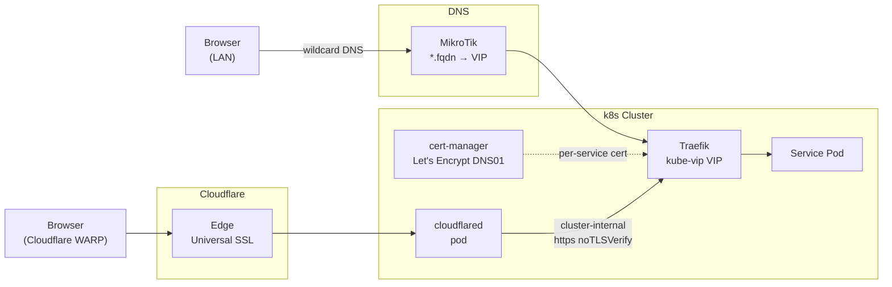

# Just another Homelab IaC or home operations repo

<div align="center">

[](https://github.com/kecsi-san/homelab/releases)
[](https://github.com/kecsi-san/homelab/actions/workflows/lint.yml)
[](LICENSE)


[](https://renovatebot.com)
[](https://pre-commit.com)


</div>

---

##  Intro

This repository tries to follow a modular **LEGO approach**, build up automated resuable components.

- Each Ansible role is self-contained and independently runnable via tags.
- Ansible roles usable for both workstation setup or a bare-metal Kubernetes homelab node.
- Kubernetes clusters use a self-hosted platform stack managed via GitOps (ArgoCD).

##  Clusters

**k8s** — 4-node bare-metal HA cluster running Kubespray 2.31 + Cilium CNI. Three control plane nodes with kube-vip providing a stable API VIP; one dedicated worker. All applications managed by ArgoCD via an app-of-apps pattern.

**k3s** — Single-node development cluster running on WSL2 (penguinaid). Hosts the IDP stack (Authentik + Forgejo) and a Homepage dashboard for local access. Uses the same GitOps pattern as the bare-metal cluster with a separate ArgoCD root app.

##  Stack

### Core Components

- **[Kubespray](https://kubespray.io)** — Kubernetes cluster provisioning on bare metal
- **[Cilium](https://cilium.io)** — CNI with eBPF-based networking and network policy
- **[kube-vip](https://kube-vip.io)** — Control plane HA; API server VIP and Traefik load balancer VIP
- **[ArgoCD](https://argo-cd.readthedocs.io)** — GitOps controller; app-of-apps, two independent cluster stacks
- **[cert-manager](https://cert-manager.io)** — Automated Let's Encrypt certificates via DNS01 (Cloudflare)
- **[Traefik](https://traefik.io)** — Ingress controller; dual-path: LAN cert-manager TLS + Cloudflare Tunnel
- **[Sealed Secrets](https://sealed-secrets.netlify.app)** — Encrypted secrets safe to commit; separate key pairs per cluster
- **[Ansible](https://www.ansible.com)** — Node provisioning, workstation setup, cluster lifecycle management

### Applications

| Service | Purpose | Access |
|---------|---------|--------|
| [Authentik](https://goauthentik.io) | SSO / Identity Provider — OIDC for all platform services | authentik.fqdn |
| [Forgejo](https://forgejo.org) | Self-hosted Git server, OCI registry, and CI runner | forgejo.fqdn |
| [Backstage](https://backstage.io) | Internal developer portal — catalog, scaffolder, TechDocs | backstage.fqdn |
| [Outline](https://www.getoutline.com) | Self-hosted wiki and knowledge base | outline.fqdn |
| [Mealie](https://mealie.io) | Self-hosted recipe manager | mealie.fqdn |
| [Homepage](https://gethomepage.dev) | Start page with live cluster and service widgets | homepage.kecskemethy.com |
| [Headlamp](https://headlamp.dev) | Kubernetes dashboard | headlamp.fqdn |
| [Prometheus + Grafana](https://prometheus.io) | Cluster metrics collection and dashboards | grafana.fqdn |
| [Gatus](https://gatus.io) | Uptime monitoring and status page | gatus.fqdn |
| [ntfy](https://ntfy.sh) | Push notification server — alerts from Gatus and VolSync | ntfy.fqdn |
| [Longhorn](https://longhorn.io) | Distributed block storage across all 4 nodes | — |
| [CloudNativePG](https://cloudnative-pg.io) | PostgreSQL operator — shared cluster for Forgejo, Authentik, Outline | — |
| [VolSync](https://volsync.readthedocs.io) | PVC backup operator — daily restic snapshots to NFS backup server | — |
| [Garage](https://garagehq.deuxfleurs.fr) | S3-compatible object storage | — |

> k8s is the primary homelab cluster. k3s is a development/experimentation mirror but mostly for lightweight services.

### GitOps

ArgoCD manages all applications via an app-of-apps pattern. The root app for each cluster bootstraps everything; from that point ArgoCD self-manages all child apps directly from this repo.

```
kube-gitops/
├── k8s/              # bare-metal 4-node cluster
│   ├── root.yaml     # app-of-apps entry point
│   ├── authentik/
│   ├── forgejo/
│   ├── longhorn/
│   └── ...
└── k3s/              # WSL2 single-node dev cluster
    ├── root.yaml
    ├── authentik/
    ├── forgejo/
    └── ...
```

##  Networking

Two ingress paths serve all cluster services:



**LAN path:** MikroTik wildcard DNS resolves `*.fqdn` to the Traefik kube-vip VIP. cert-manager issues per-service Let's Encrypt certificates via DNS01 challenge against the Cloudflare API; each service has its own cert and TLS secret.

**Cloudflare path:** Cloudflare WARP routes remote traffic through the Cloudflare edge to a `cloudflared` pod running inside the cluster. Traefik receives it over cluster-internal HTTPS (`noTLSVerify: true`); the browser sees Cloudflare's Universal SSL certificate.

##  Hardware

<details>
<summary>Expand</summary>

### Compute

| Hostname | Model | CPU | RAM | Role |
|----------|-------|-----|-----|------|
| hped800g5 | HP EliteDesk 800 G5 Micro | Intel i5-9500T (6C) | 32 GB | Control Plane + etcd |
| hped800g62 | HP EliteDesk 800 G6 Micro | Intel i5-10500T (6C) | 24 GB | Control Plane + etcd |
| hppd600g6 | HP ProDesk 600 G6 Micro | Intel i5-10500T (6C) | 32 GB | Control Plane + etcd + NFS |
| hped800g61 | HP EliteDesk 800 G6 Micro | Intel i5-10500T (6C) | 16 GB | Worker |
| penguinaid | Dev workstation (WSL2) | — | — | k3s single-node |

### Storage

- **Longhorn** — distributed block storage striped across all 4 kube nodes; default `StorageClass`
- **NFS backup server** — hppd600g6 hosts a 100 GiB LVM volume at `/backups`; restic REST server on `:8000`; daily VolSync snapshots from ntfy, Gatus, and Mealie PVCs

### Network

- **Router / DNS:** MikroTik; wildcard DNS for `*.fqdn` and `*.k3s.fqdn`; NTP server for all cluster nodes
- **Remote access:** Cloudflare Tunnel (`cloudflared` pod in-cluster); Cloudflare WARP for client-side routing

</details>

##  Cloud Dependencies

| Service | Use | Cost |
|---------|-----|------|
| [Cloudflare](https://cloudflare.com) | DNS, Tunnel (remote access), WARP (client), DNS01 challenge for cert-manager | Free |
| [GitHub](https://github.com) | Repository hosting, CI (Actions), Renovate dependency updates | Free |
| [Let's Encrypt](https://letsencrypt.org) | TLS certificates issued via cert-manager DNS01 | Free |

##  Workflows

| Guide | Description |
|-------|-------------|
| [Dev/DevOps Workstation](docs/ansible/devenv.md) | Set up a local workstation — macOS or Debian/WSL2 |
| [Local k3s Cluster](docs/ansible/k3s.md) | Single-node k3s cluster for local development (WSL2 + macOS) |
| [4-Node Homelab Cluster](docs/ansible/k8s-homelab.md) | Bare-metal HA cluster, GitOps stack, Cloudflare Tunnel |

##  Reference

| Guide | Description |
|-------|-------------|
| [Quick Start](docs/ansible/quickstart.md) | Prerequisites and playbook commands for all three scenarios |
| [Roles](docs/ansible/roles.md) | Role naming conventions, structure, and full role inventory |
| [CI/CD](docs/ansible/ci-cd.md) | CI pipeline, linting, pre-commit hooks, and changelog automation |
| [All docs](docs/README.md) | Full documentation index |

---

##  Tool Management Philosophy

| Method | macOS | Linux | When to use |
|--------|-------|-------|-------------|
| **APT** | — | ✓ | System-level, rarely changing packages; well-maintained in Debian repos |
| **Homebrew** | ✓ formula + cask | ✓ Linuxbrew formula | Frequently updated tools; tools not in APT or lagging upstream |
| **uv** | ✓ | ✓ | Python CLI tools and library packages |

> APT for system stability (Linux), Homebrew for freshness and macOS-native installs, uv for the Python ecosystem.

---

##  Thanks

- Inspired by [homelab](https://github.com/topics/homelab), [home operations](https://github.com/topics/home-operations) and similar repositories and communities.
- Kubernetes cluster provisioned with [Kubespray](https://kubespray.io).
